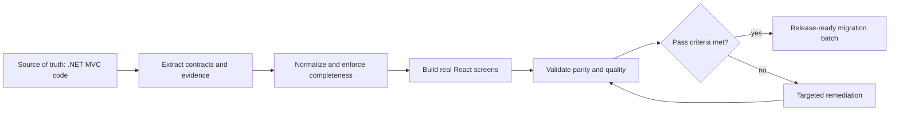
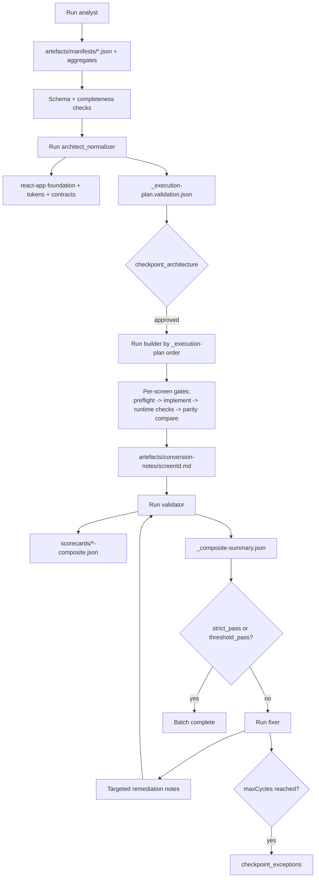

# Autonomous .NET to React Migration (Agent-Driven, Scriptless)

This repository uses a deterministic, agent-driven pipeline to migrate .NET MVC/Razor frontends into React with like-to-like fidelity.

This README is the final consolidated operating model derived from:
- `01-approach-dotnet-to-react-migration-v2.md`
- `02-implementation-dotnet-to-react-migration-v2.md`
- active contracts in `.codex/agents/*.toml`, `.codex/schemas/*`, and `AGENTS.md`

## 1) Operating Principles

- Screen modeling is **feature-screen grouped**: one manifest per business screen, with `views[]` + `actions[]`.
- Execution is **instruction-first**: agents are authoritative, not repository scripts.
- Determinism is mandatory: same manifests/config produce the same output file set and structure.
- Builder must produce **real screens**, not manifest-preview/debug UIs.
- Quality is enforced through a gated loop: `validator -> fixer/builder -> validator`.

## 2) Conceptual Approach

This migration model is a quality-controlled factory, not a one-shot code generation pass.

### Pipeline overview

The migration is structured as a linear pipeline of five specialized agents plus a validation system that covers both visual and functional parity. The agents operate sequentially through analysis and architecture phases, then shift to screen-wise deterministic build/verify gates, with automated validation and remediation completing the loop.

| Agent | Role | Input | Output | Tooling mode |
|-------|------|-------|--------|--------------|
| Agent 1 (`analyst`) | Extract render-complete manifests from .NET source | .NET codebase (Razor/CSHTML, controllers, routes, models/DTOs, templates, CSS) | Screen manifests + aggregate manifests + execution plan + manifest validation report | Codex agent reasoning + source evidence mapping |
| Agent 2 (`architect_normalizer`) | Normalize manifests and prepare deterministic React foundation | Analyst outputs (`artefacts/manifests/*`) | React foundation, project rules/config, normalized execution plan, execution-plan validation report | Codex agent reasoning + schema/completeness enforcement |
| Agent 3 (`builder`) | Generate like-to-like React screens from contracts | Per-screen manifest + execution plan + project rules | React pages/components/hooks/types, E2E specs, per-screen conversion notes | Codex agent reasoning + runtime build/render checks |
| Agent 4 (`validator`) | Validate parity and quality across required dimensions | Built React output + manifests + runtime evidence | Per-screen composite scorecards + composite summary | Codex agent reasoning + runtime/browser/static evidence checks |
| Agent 5 (`fixer`) | Apply targeted remediations from validator evidence | Validator scorecards + conversion notes + manifests | Focused code fixes and/or manifest patches, retry notes | Codex agent reasoning with iterative remediation loop |

### Conceptual goal

Convert .NET MVC/Razor screens into React screens with:
- like-to-like render structure and behavior
- deterministic outputs
- measurable quality gates at every stage
- minimal human intervention limited to checkpoints and exceptions

### Conceptual phases

1. **Extract truth from source**  
Analyst builds evidence-backed manifests that capture render, behavior, validation, styles, templates, and business rules.

2. **Normalize and de-risk**  
Architect normalizes manifests, enforces completeness thresholds, creates/validates React foundation, and prepares deterministic execution order.

3. **Generate production-intent UI**  
Builder creates real React screens from manifest contracts, not preview artifacts, and enforces per-screen completion gates.

4. **Measure parity and quality**  
Validator scores visual, structural, functional, state, a11y, and performance dimensions with explicit PASS/REVIEW/FAIL outcomes.

5. **Iterate remediation**  
Fixer applies targeted corrections; loop continues until strict/threshold pass or max cycle limit.

### Conceptual quality model

- **Evidence-first**: confidence must map to source evidence.
- **Fail-fast**: weak manifests or incomplete contracts block downstream stages.
- **Deterministic**: same inputs produce same structure and outputs.
- **Closed-loop**: defects are measured, fixed, and re-measured.
- **Exception-driven human review**: humans intervene at architecture approval and unresolved exception queues.

### Conceptual lifecycle diagram

## 3) Canonical Repository Contract

- `.codex/agents/`: behavior contracts for `analyst`, `architect-normalizer`, `builder`, `validator`, `fixer`.
- `.codex/schemas/`: stable schema contracts.
- `.codex/rules/`: global migration and React project rules.
- `artefacts/`: generated outputs only (manifests, validation, scorecards, notes).
- `react-app/`: generated/normalized React target.
- `.NET source`: auto-discovered by analyst (no hardcoded project path).

## 4) Final Pipeline Diagram

## 5) Agent Responsibilities

### `analyst`
Input:
- auto-discovered .NET source (controllers, views, templates, routes, DTOs/models, annotations, JS hooks, CSS)

Output:
- `artefacts/manifests/{screenId}.json` (grouped per feature screen)
- aggregates:
  - `_summary.json`
  - `_api-catalog.json`
  - `_component-frequency.json`
  - `_business-rules-audit.json`
  - `_complexity-routing.json`
  - `_execution-plan.json`
  - `_manifest-validation-report.json`

Must enforce:
- route-action-view closure
- validation completeness (annotations + ModelState + service/EF paths)
- style/template coverage
- navigation completeness (layout + local)
- explicit `unknowns[]` and `blocked`
- internal self-healing extraction loop before handoff

### `architect_normalizer`
Input:
- manifests + aggregate outputs

Output:
- `react-app` bootstrap/foundation if missing
- `.codex/rules/react-project.md`
- `react-app/conversion-config.json`
- normalized execution plan + `_execution-plan.validation.json`

Must enforce:
- completeness gate before builder
- deterministic order and cycle-free dependency graph
- token/convention enforcement

### `builder`
Input:
- `artefacts/manifests/{screenId}.json`
- `_execution-plan.json`
- codex rules + conversion config

Output:
- `react-app/src/pages/**`
- `react-app/src/**` supporting hooks/types/components
- `react-app/e2e/{screenId}.spec.ts`
- `artefacts/conversion-notes/{screenId}.md`

Per-screen mandatory gates:
- preflight contract validation (`renderModel`, `likeToLikeSpec`, `buildFoundation`, `businessLogicTrace`)
- deterministic implementation (no preview/debug fallback)
- heuristic patching only when evidence-backed
- runtime checks (build/renderability + E2E updates)
- parity comparison (browser-based preferred, source-based fallback)
- no advance to next screen with unresolved critical mismatches unless explicitly blocked/accepted

### `validator`
Output:
- `artefacts/validation/scorecards/{screenId}-composite.json`
- `artefacts/validation/scorecards/_composite-summary.json`

Must evaluate (all dimensions):
- visual fidelity
- structural parity
- functional parity
- state coverage
- accessibility baseline
- performance guardrail
- build quality guardrails (including manifest-preview fallback detection)
- grouped multi-action coverage (within one screen manifest)

### `fixer`
Input:
- validator scorecards + evidence

Output:
- targeted code/config fixes and/or manifest patch proposals
- attempt notes: `artefacts/conversion-notes/{screenId}-fix-{attempt}.md`

Priority:
1. functional
2. structural
3. visual

Loop termination:
- `strict_pass`, or
- `threshold_pass`, or
- `maxCycles` -> `checkpoint_exceptions`

## 6) Scorecard Contract (Composite)

Each `{screenId}-composite.json` should include:
- per-dimension `status` (`PASS|NEEDS_REVIEW|FAIL|BLOCKED`)
- severity
- concise evidence references
- blocking vs non-blocking classification
- `blockingReason` and `requiredInput` when prerequisite gaps prevent execution

`_composite-summary.json` should include:
- screen-level outcomes
- `criticalFailures`
- `thresholdPass`
- batch decision (`strict_pass|threshold_pass|failed|blocked|maxCycles`)

## 7) Minimal Run Prompts (in Codex)

Run in order:

1. `Run analyst.`
2. `Run architect_normalizer.`
3. `Run builder.`
4. `Run validator.`
5. `Run fixer loop until threshold_pass (or maxCycles).`

Optional subset build:
- `Run builder only for these screenIds: <id1>, <id2>, ... preserving _execution-plan dependency order.`

## 8) Acceptance Definition

A screen is migration-complete only when:
- manifest completeness and evidence thresholds pass,
- builder completion gates pass,
- validator dimensions pass per policy,
- no unresolved critical issues remain outside approved checkpoint exceptions.

## 9) Checkpoints

- `checkpoint_architecture`: after architect normalization (foundation/config/rules/execution plan)
- `checkpoint_exceptions`: after retry budget exhaustion for unresolved failures
